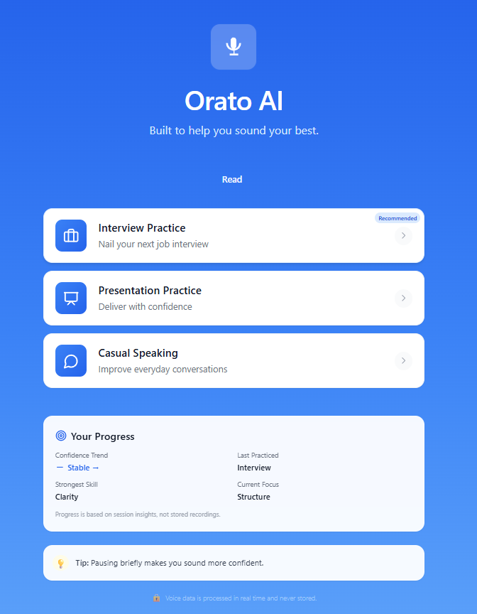
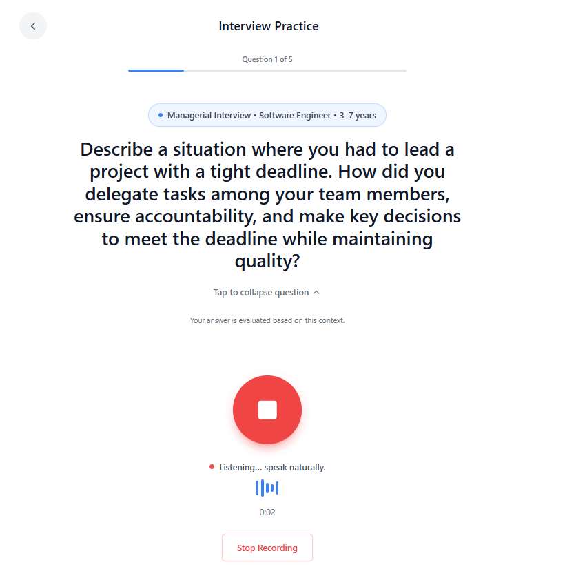
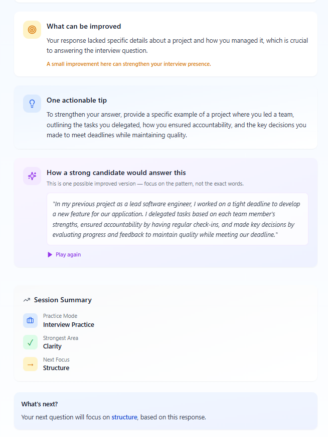

<div align="center">

# 🎙️ Orato AI

### Real-time AI-powered communication coach that analyzes spoken responses and provides structured feedback to improve clarity, confidence, and delivery.

[](https://react.dev/)
[](https://vitejs.dev/)
[](https://tailwindcss.com/)
[](https://nodejs.org/)
[](https://ai.google.dev/)
[](./LICENSE)

</div>

---

## The Problem

Most people struggle with spoken communication — interviews, presentations, and everyday conversations — yet receive little to no structured feedback on how they actually sound. Traditional coaching is expensive, inaccessible, and not available in real time.

## The Solution

Orato AI is a production-grade, full-stack AI coaching platform. Users record their spoken responses, and the system instantly transcribes, analyzes, and returns structured coaching feedback — scoring clarity, confidence, fluency, and structure — powered by Google Gemini or OpenAI.

**Key value:** Real-time, structured, actionable coaching available to anyone with a browser.

---

---

## 🔎 Quick Navigation

<div align="center">

[🚀 Overview](#-overview) •
[🎥 Demo](#-demo) •
[✨ Features](#-features) •
[🏗 Architecture](#-architecture) •
[⚙️ Tech Stack](#️-tech-stack)

<br/>

[🔄 How It Works](#-how-it-works) •
[📂 Project Structure](#-project-structure) •
[🛠 Setup](#️-setup-instructions) •
[🔐 Environment](#-environment-variables)

<br/>

[⚡ Performance](#-performance--optimization) •
[📡 API](#-api-reference) •
[🚧 Future Plans](#-future-improvements)

<br/>

[🤝 Contributing](#-contributing) •
[📄 License](#-license)

</div>

<p align="center">
  <b>AI-Powered Communication Coach • Real-Time Feedback • Production-Ready Architecture</b>
</p>

---

## Demo

<div align="center">

| Home / Mode Selection | Voice Practice Session | AI Feedback Results |
|:---:|:---:|:---:|
|  |  |  |
| Choose from Interview, Presentation, or Casual Speaking modes | Record your response with live audio waveform visualization | Receive structured scores, strengths, improvements, and a sample answer |

</div>

---

## Features

| Feature | Description |
|---|---|
| 🎙 **Real-time voice recording** | Capture spoken responses using the MediaRecorder API with live waveform visualization |
| 🧠 **AI-powered feedback** | Coaching analysis via Google Gemini API or OpenAI (configurable) |
| 📊 **Structured scoring** | Scores across Clarity, Confidence, Fluency, and Structure (0–100) |
| 🗣 **Speech-to-text** | Browser-native Web Speech API transcription with no third-party cost |
| 🔊 **Text-to-speech playback** | AI feedback narrated back via SpeechSynthesis API |
| 📈 **Session analytics** | Track improvement over time with per-session history and trend charts |
| 🌐 **Multilingual support** | Full English and Hindi interface via built-in translation layer |
| ⚡ **Adaptive question generation** | AI-generated questions tailored to role, difficulty, and session history |
| 🛡 **Secure backend proxy** | API keys never exposed to the browser — all AI calls routed through the Express server |
| 💾 **In-memory caching** | Response caching and transcript deduplication to reduce API cost and latency |
| ⚠️ **Graceful fallback** | Intelligent fallback feedback when AI is unavailable — no broken states |
| 🌙 **Dark mode** | Full dark/light theme support |

---

## Architecture

```
┌─────────────────────────────────────────────────────────────────┐
│                         FRONTEND (React + Vite)                 │
│                                                                 │
│   [Home] → [Setup] → [VoicePractice] → [AIFeedback]            │
│       MediaRecorder API       Web Speech API (STT)              │
│       SpeechSynthesis API (TTS)    Recharts (analytics)         │
└──────────────────────────┬──────────────────────────────────────┘
                           │  POST /api/ai  (transcript + prompt)
                           ▼
┌─────────────────────────────────────────────────────────────────┐
│                    BACKEND (Node.js + Express)                  │
│                                                                 │
│   Rate Limiter → Request Validator → Cache Lookup               │
│                         │                                       │
│              ┌──────────┴──────────┐                           │
│              ▼                     ▼                            │
│        Google Gemini API      OpenAI API                        │
│              └──────────┬──────────┘                           │
│                         ▼                                       │
│        Response Validator → Cache Store → JSON Response         │
└──────────────────────────┬──────────────────────────────────────┘
                           │  Structured feedback JSON
                           ▼
                    ┌──────────────┐
                    │  React UI    │
                    │  Score cards │
                    │  Coaching    │
                    │  insights    │
                    └──────────────┘
```

**Request flow:**
```
User speaks → MediaRecorder captures audio
           → Web Speech API transcribes to text
           → Frontend sends transcript + prompt to backend
           → Backend checks cache (dedup + prompt cache)
           → Backend calls Gemini / OpenAI with schema prompt
           → Response validated, clamped, cached
           → Structured JSON returned to frontend
           → UI renders scores, strengths, improvements, sample answer
           → SpeechSynthesis reads feedback aloud (optional)
```

---

## Tech Stack

**Frontend**
| Technology | Version | Purpose |
|---|---|---|
| React | 18 | UI framework |
| Vite | 6 | Build tool & dev server |
| Tailwind CSS | 3 | Utility-first styling |
| Framer Motion | 11 | Animations |
| Recharts | 2 | Session analytics charts |
| React Router | 6 | Client-side routing |
| React Query | 5 | Server state management |

**Backend**
| Technology | Version | Purpose |
|---|---|---|
| Node.js | 18+ | Runtime |
| Express | 4 | HTTP server |
| express-rate-limit | 7 | API rate limiting |
| dotenv | 16 | Environment config |
| cors | 2 | Cross-origin policy |

**AI & Browser APIs**
| API | Purpose |
|---|---|
| Google Gemini API | Primary AI provider for feedback & question generation |
| OpenAI API | Optional secondary AI provider |
| Web Speech API (SpeechRecognition) | Browser-native speech-to-text |
| MediaRecorder API | Audio capture with waveform |
| SpeechSynthesis API | Text-to-speech feedback playback |

---

## How It Works

```
1. User selects a practice mode (Interview / Presentation / Casual)
       ↓
2. AI generates an adaptive question based on role and difficulty
       ↓
3. User records their spoken response via the microphone
       ↓
4. Web Speech API transcribes the audio to text in real time
       ↓
5. Transcript and coaching prompt are sent to the backend proxy
       ↓
6. Backend checks the in-memory cache; on a miss, calls Gemini or OpenAI
       ↓
7. AI returns structured JSON: scores, strengths, improvements, tip, sample answer
       ↓
8. Frontend renders animated score cards, coaching insights, and a model answer
       ↓
9. SpeechSynthesis reads the feedback aloud if enabled
       ↓
10. Session is saved; analytics charts update with the new data point
```

---

## Project Structure

```
Orato-AI/
├── index.html
├── vite.config.js
├── tailwind.config.js
├── package.json
│
├── src/
│   ├── main.jsx               # App entry point
│   ├── App.jsx                # Route definitions
│   ├── Layout.jsx             # Shell layout
│   │
│   ├── pages/
│   │   ├── Home.jsx           # Mode selection dashboard
│   │   ├── Intro.jsx          # Onboarding / landing
│   │   ├── InterviewSetup.jsx # Configure interview parameters
│   │   ├── QuestionSetup.jsx  # Custom question setup
│   │   ├── VoicePractice.jsx  # Recording + STT interface
│   │   └── AIFeedback.jsx     # Feedback results & analytics
│   │
│   ├── components/
│   │   ├── VoiceWaveform.jsx  # Live audio visualizer
│   │   ├── ScoreIndicator.jsx # Animated score ring
│   │   ├── SessionSummary.jsx # Per-session summary card
│   │   ├── ProgressSnapshot.jsx
│   │   ├── SettingsModal.jsx
│   │   ├── SettingsProvider.jsx
│   │   ├── ErrorBoundary.jsx
│   │   ├── translations.jsx   # EN / HI strings
│   │   └── ui/                # Radix UI + shadcn components
│   │
│   ├── api/
│   │   ├── apiClient.js       # Fetch wrapper (frontend → backend)
│   │   ├── aiService.js       # AI endpoint helpers
│   │   └── sessionAnalytics.js
│   │
│   ├── lib/
│   │   ├── AuthContext.jsx
│   │   ├── logger.js
│   │   ├── healthCheck.js
│   │   └── utils.js
│   │
│   └── utils/
│       └── index.js
│
└── server/
    ├── index.js               # Express server — AI proxy, cache, rate limit
    ├── config.js              # Centralised server config
    ├── package.json
    └── .env.example           # Environment variable template
```

---

## Setup Instructions

### Prerequisites

- Node.js 18+
- A Google Gemini API key **or** an OpenAI API key

### 1. Clone the repository

```bash
git clone https://github.com/amansethhh/Orato-AI.git
cd Orato-AI
```

### 2. Install frontend dependencies

```bash
npm install
```

### 3. Install backend dependencies

```bash
cd server
npm install
cd ..
```

### 4. Configure environment variables

```bash
cp server/.env.example server/.env
```

Open `server/.env` and add your API key:

```env
# Choose your AI provider: auto | gemini | openai
AI_PROVIDER=auto

GEMINI_API_KEY=your_gemini_key_here
OPENAI_API_KEY=your_openai_key_here   # optional

PORT=3001
FRONTEND_URL=http://localhost:5173
NODE_ENV=development
```

> **Note:** If neither key is provided, the server runs in **mock mode** and returns locally-generated coaching feedback — useful for UI development without an API key.

### 5. Start the backend

```bash
cd server
node index.js
```

Expected output:
```
╔══════════════════════════════════════════════════════╗
║           🎙️  Orato AI — Backend Server              ║
╚══════════════════════════════════════════════════════╝

[INFO] Server running on http://localhost:3001
[INFO] AI Provider: GEMINI
```

### 6. Start the frontend

Open a new terminal from the project root:

```bash
npm run dev
```

The app opens automatically at **http://localhost:5173**.

---

## Environment Variables

### Backend — `server/.env`

| Variable | Required | Default | Description |
|---|---|---|---|
| `GEMINI_API_KEY` | Yes* | — | Google Gemini API key |
| `OPENAI_API_KEY` | Yes* | — | OpenAI API key |
| `AI_PROVIDER` | No | `auto` | Force a provider: `auto`, `gemini`, `openai` |
| `PORT` | No | `3001` | Backend server port |
| `FRONTEND_URL` | No | `http://localhost:5173` | Allowed CORS origin |
| `NODE_ENV` | No | `development` | `development` or `production` |

*At least one AI key is required for real feedback. Without either, the server runs in mock mode.

### Frontend — `.env` (optional)

| Variable | Description |
|---|---|
| `VITE_API_URL` | Backend base URL (defaults to `/api` via Vite proxy) |

---

## Performance & Optimization

| Optimization | Implementation |
|---|---|
| **Code splitting** | Vite `manualChunks` separates React, UI libs, and charts into parallel-loaded bundles |
| **Lazy loading** | Route-level code splitting via React Router lazy imports |
| **In-memory caching** | Backend caches AI responses by prompt hash (TTL: configurable) |
| **Transcript deduplication** | Identical transcripts return cached results within a dedup window |
| **Rate limiting** | `express-rate-limit` prevents abuse and protects API quota |
| **Request validation** | Prompt and transcript length limits enforced server-side before any AI call |
| **Exponential backoff** | Automatic retry with backoff on AI rate-limit (429) responses |
| **Graceful fallback** | Context-aware locally-generated feedback ensures zero broken states |
| **Timeout handling** | Per-request AbortController timeout on all AI calls |

---

## API Reference

### `GET /api/health`

Returns server status, active AI provider, uptime, and cache size.

```json
{
  "status": "ok",
  "provider": "gemini",
  "uptime": 142,
  "cacheSize": 3,
  "timestamp": "2025-01-01T00:00:00.000Z"
}
```

### `POST /api/ai`

Analyze a spoken response and return structured coaching feedback.

**Request body:**
```json
{
  "prompt": "The user answered the interview question: 'Tell me about yourself'",
  "transcript": "Hi, I'm a software engineer with 3 years of experience..."
}
```

**Response:**
```json
{
  "feedback": "Your opening established context well. Consider adding a specific achievement to strengthen impact.",
  "clarity": 78,
  "confidence": 65,
  "structure": 72,
  "fluency": 80,
  "strengths": ["Clear introduction", "Good pacing"],
  "improvements": ["Add a quantifiable result", "Reduce filler words"],
  "tip": "Use the STAR framework: Situation, Task, Action, Result.",
  "sampleAnswer": "I'm a software engineer with 3 years of experience...",
  "filler_word_count": 4,
  "_provider": "gemini"
}
```

### `POST /api/ai/question`

Generate an adaptive practice question.

**Request body:**
```json
{
  "prompt": "Generate a behavioral interview question for a senior frontend engineer role, medium difficulty."
}
```

**Response:**
```json
{
  "question": "Describe a situation where you had to refactor a large codebase under time pressure. How did you prioritize?"
}
```

---

## Future Improvements

- [ ] **Real-time streaming AI** — Stream AI tokens to the UI for lower perceived latency
- [ ] **User authentication** — Persistent accounts with cross-device session history
- [ ] **Cloud deployment** — Docker + Railway / Render backend, Vercel frontend
- [ ] **Whisper STT** — Server-side transcription via OpenAI Whisper for higher accuracy
- [ ] **Video analysis** — Webcam-based posture and eye-contact scoring
- [ ] **Interview simulation** — Multi-turn conversational interview mode
- [ ] **PDF export** — Download session feedback reports (html2canvas + jsPDF already included)
- [ ] **Team / recruiter dashboard** — Share sessions and track candidate progress

---

## Contributing

Contributions are welcome. Please follow these steps:

1. Fork the repository
2. Create a feature branch: `git checkout -b feature/your-feature-name`
3. Make your changes and commit: `git commit -m "feat: add your feature"`
4. Push to your fork: `git push origin feature/your-feature-name`
5. Open a pull request against `main`

Please keep pull requests focused and include a clear description of the change and its motivation.

---

## License

This project is licensed under the [MIT License](./LICENSE).

---

<div align="center">
Built with ❤️ by <a href="https://github.com/amansethhh">amansethhh</a>
</div>
